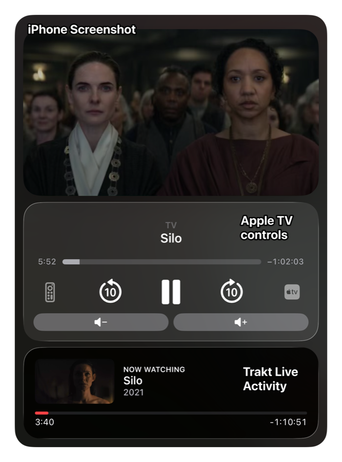

# Trakt Scrobbler for Home Assistant

<br clear="left"/>

[](https://my.home-assistant.io/redirect/hacs_repository/?owner=FezVrasta&repository=ha-trakt-scrobbler&category=integration)

Scrobbles whatever your Home Assistant media players are playing to
[Trakt.tv](https://trakt.tv). Tested against a real Apple TV, works with any
`media_player` (Plex, Jellyfin, Kodi, Emby, Android TV…).

- Sends `start` / `pause` / `stop` scrobbles as playback progresses.
- Identifies the exact episode even when the player reports only a show name,
  by matching the episode thumbnail against Trakt's stills.
- Exposes a sensor per player with the artwork, title, episode, and progress.

<p align="center">
  
</p>

Because the scrobble lands on Trakt in real time, the Trakt app's Live Activity
follows along with whatever the Apple TV is playing.

## Install

Click the badge above (or add this repo to HACS as a custom **Integration**),
install, restart, then add **Trakt Scrobbler** from
**Settings → Devices & Services**. The setup wizard walks you through signing in
and picking your players.

## Options

| Option | Default | What it does |
| --- | --- | --- |
| Media players | — | Which players to watch |
| Ignored apps | YouTube, Music, Podcasts… | Skip playback whose app name/ID matches |
| Minimum duration | 300 s | Anything shorter is treated as a clip |
| Progress refresh interval | 300 s | How often an ongoing scrobble is re-sent |
| Match episodes by thumbnail | on | Identify the episode from the player's artwork |


## Sensor

One sensor per player. State is `idle` / `watching` / `paused` / `unmatched` /
`ignored` / `error`, its picture is the episode still, and its attributes carry
the now-playing details:

```json
{
  "player_state": "playing",
  "title": "Farewell",
  "show_title": "Silo",
  "episode_code": "S03E09",
  "season": 3, "episode": 9,
  "trakt_url": "https://trakt.tv/shows/silo/seasons/3/episodes/9",
  "position": "44:32", "duration": "1:07:55", "remaining": "23:23",
  "progress": 65.6
}
```

## Services

- `trakt_scrobbler.parse_preview` — preview how a title/player would match.
- `trakt_scrobbler.stop_scrobble` — end the current scrobble for a player.
- `trakt_scrobbler.refresh_token` — force an OAuth token refresh.

## License

MIT
